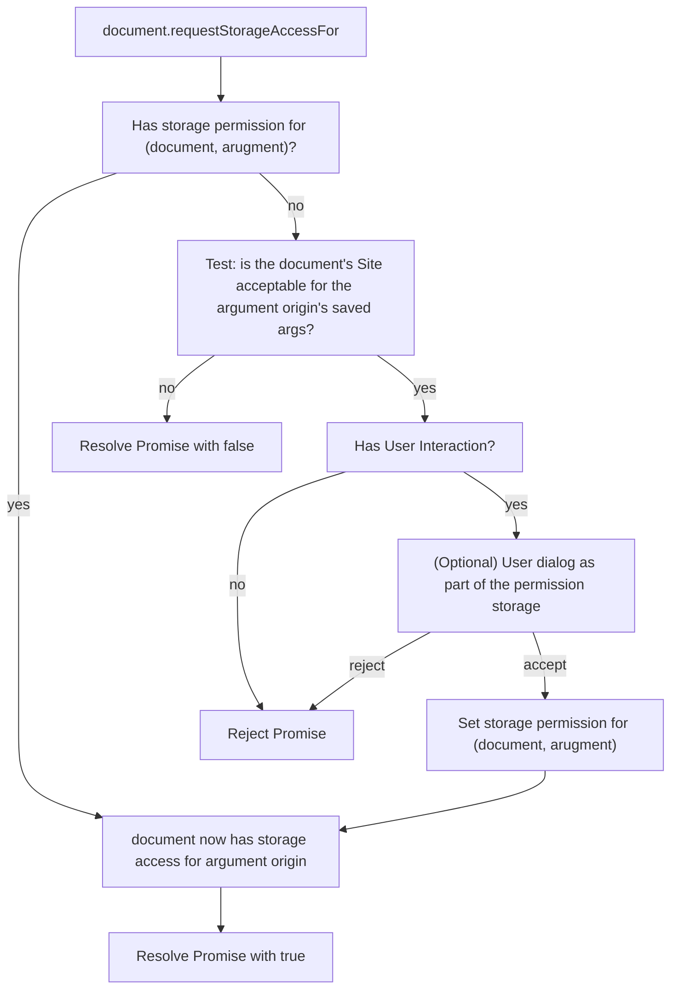
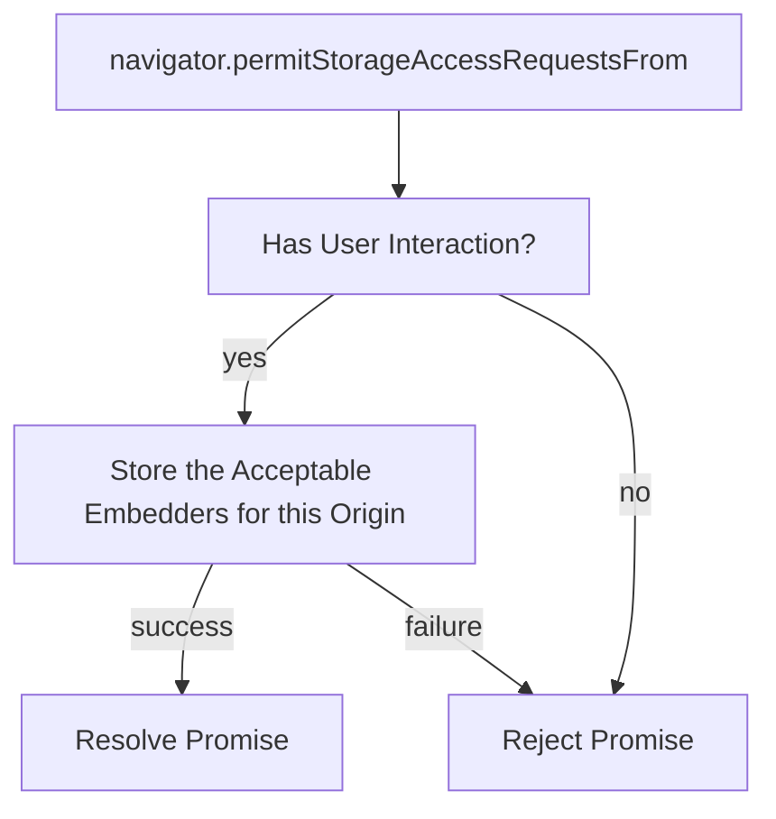

# Top-Level Storage Access API Extension

To support use cases of federated authentication, browsers have used priveleged APIs or heuristics to provide access to unpartitioned cross-site cookies to embedded resources in the top level. This is a proposal to provide a web-exposed mechanism for providing the same access while retaining some of the user-centric properties of the traditional Storage Access API. In particular, this extension requires user activation inside of the origin of the embedded resources.

## The API Shape

This API requires two function calls to occur before giving unpartitioned cookie access to a cross-site domain on a page: `document.requestStorageAccessFor("https://auth.exampleIDP.com")` on the page in question and `navigator.permitStorageAccessRequestsFrom({/* details of which RPs to allow */})` on the IDP's top-level page. These calls can be made in either order and each serve two purposes. the call to `document.requestStorageAccessFor` is where the page opts into allowing an origin to use unpartitioned cookies and where the user may be shown a dialog to express their choice.  `navigator.permitStorageAccessRequestsFrom` is where the identity provider opts into which pages are permitted to use the unpartitioned cookies and where the user must interact with the identity provider as a top-level page.

On completion of both of these calls, in whichever order, a Permission is set. This Permission can be tested with `navigator.permissions.query()` and a callback for any updates can be set on the returned `PermissionStatus`. 

### Details of `document.requestStorageAccessFor`

A similar function is already defined in the Storage Access API, however we need some differences to support this use case. It needs to accept an object argument that refers to the origin that should get unpartitioned storage access, shown above as a string argument. It also may be useful to return a promise that resolves to a boolean, which would indicate whether or not this request is completed because of a prior grant or call to `navigator.permitStorageAccessRequestsFrom`. 

This will set a permission if the origin allows this request based on the calling Document. 

This comes with a similar pair funciton to the regular storageAccessAPI that indicates whether or not the given origin currently has access to its unpartitioned cookies.

```web-idl
partial interface Document {
	Promise<boolean> requestStorageAccessFor(USVString origin);
	Promise<boolean> hasStorageAccessFor(USVString origin);
}
```




### Details of `navigator.permitStorageAccessRequestsFrom`

This function needs to accept an argument for which pages should be allowed to request storage access for the calling origin. There are a lot of ways to think to do this, but the following jump out as immediately useful to me: allow all, a list of acceptable sites, and a URI that will reply with `200 OK` when the `Origin` header is an acceptable requester. Exactly one of these elements should be provided.

This function should be asynchronous and doesn't need to return a value: an undefined resolving Promise is reasonable. However, it should require user interaction to succeed.

```web-idl
dictionary PermitStorageAccessArgument {
	boolean allowAll;
	USVString[] sites;
	USVString queryURI;
}

partial interface Navigator {
	Promise<undefined> permitStorageAccessRequestsFrom(PermitStorageAccessArgument arg);
}
```




## Example

A user visits a page `https://www.example.com` that wants to give top-level unparititoned storage access to `https://auth.identity.com`. It does this by having the user interact with the page and calling `document.requestStorageAccessFor("https://auth.identity.com")`. If they are logged in, the promise resolves to `true` and all subsequent requests to `https://auth.identity.com` have unpartitioned cookies.  If they aren't already logged in, the returned promise resolves to `false` and the page knows to navigate the user to the IDP to log in. When the user returns, this process begins anew.

When the user navigates to `https://auth.identity.com`, and gives user interaction, the new page calls `navigator.permitStorageAccessRequestsFrom({/*...*/})`, with argument that allows requests from `https://example.com`.

At any time, the page `https://www.example.com` can call `document.hasStorageAccess({"top-level":{"for":"https://auth.identity.com"}})` to determine its status, or can use `navigator.permissions.query({name: "top-level-storage-access"})` to determine its status and add a callback for any changes to that status.


The following is some example HTML/JS that shows how these might be used.

`https://www.example.com/index.html`:

```html
<html>
  <head>
    <script>
      async function button_cb() {
        let logged_in = await document.requestStorageAccessFor("https://auth.identity.com");
        if (logged_in) {
          unhide_something();
        } else {
        	window.open("https://auth.identity.com/link.html?redirect_uri=https://www.example.com/", "_self");
        }
      }
      async function unhide_something() { 
        let logged_in = false;
        try {
          logged_in = await document.requestStorageAccessFor("https://auth.identity.com");
        } catch {/* Failed because of user activation missing if not logged in */};
        if (logged_in) {
          document.getElementById("profile-picture").hidden = false;
          document.getElementById("profile-picture").src="https://auth.identity.com/me/picture.jpg"
          document.getElementById("login-button").hidden = true;
        } else {
          document.getElementById("profile-picture").hidden = true;
          document.getElementById("login-button").hidden = false;
        }
      }
    </script>
  </head>
  <body>
    <button onclick="button_cb" id="login-button" hidden>Log in with IDENTITY</button>
    />
    <script>
      unhide_something();
    </script>
  </body>
</html>
```


`https://auth.identity.com/link.html`:

```html
<html>
  <body>
    <button id="login-button" hidden></button>
    <script>
      let first_party_origin = document.referrer;
      // Validate first_party_origin's site is where this origin wants to allow top-level cookies here
      let button = document.getElementById("login-button");
      button.innerText = `Let me use my account on ${first_party_origin}`;
      button.onclick = async function button_cb() {
        await navigator.permitStorageAccessRequestsFrom({sites: [first_party_origin]});
        const queryString = window.location.search;
        const urlParams = new URLSearchParams(queryString);
        const redirect_uri = urlParams.get('redirect_uri')
        window.open(redirect_uri, "_self");
      };
      button.hidden = false;
    </script>
  </body>
</html>
```


## Constraints

1. The only interaction we can expect with the identity provider is to have to log in at some point.
2. Corollary: We must support IDP first and RP first orderings of both calls. 
3. The user must interact with the identity provider origin directly. If as a top-level is unacceptable, then the regular Storage Access API allows interacting with the identity provider in an iframe.
4. The user has to have a chance to get a permission dialog with both the IDP and RP domain
5. The IDP should only show up in a dialog with RPs that the IDP has made a call to `navigator.permitStorageAccessRequestsFrom` to permit.
6. The RP should have control over which origins have access to unpartitioned cross-site cookies.
7. The IDP should have control over which origins it allows to use unpartitioned cross-site cookies and on which sites this can occur, provided the origin meets the user interaction constraint.


## Considered (and rejected) Alternative Designs For this Use Case

1. Dialog on the IDP page: this seems confusing for the user.
2. Using the Login Status API for the IDP call: this goes against the spirit of being unobservable to web-content of the current proposal
3. The old requestStorageAccessUnderSite proposal: this was overconstrained.
4. Chrome's requestStorageAccessFor proposal: this does not respect our user-interaction constraint.
5. Storage Access API as designed, or bust: this is insufficient for non-interactive iframes.


## Open Questions

1. Would granting storage access permission to iframes for the IDP satisfy requirements here? i.e. if a call to `navigator.permitStorageAccessRequestsFrom` would bypass the user-interaction requirement of the Storage Access API, do existing IDP flows work?
2. Do we need the `queryURI` in `PermitStorageAccessArgument`? Should we permit `allowAll`?
3. Should/Can we not add a permission to the Permissions API for top-level storage access?
4. Are the names of functions fine?
